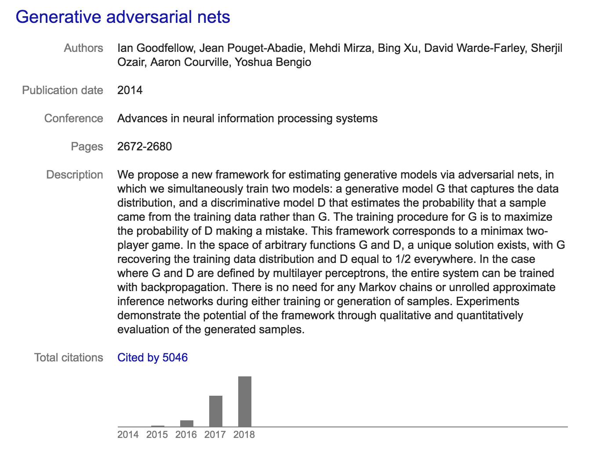
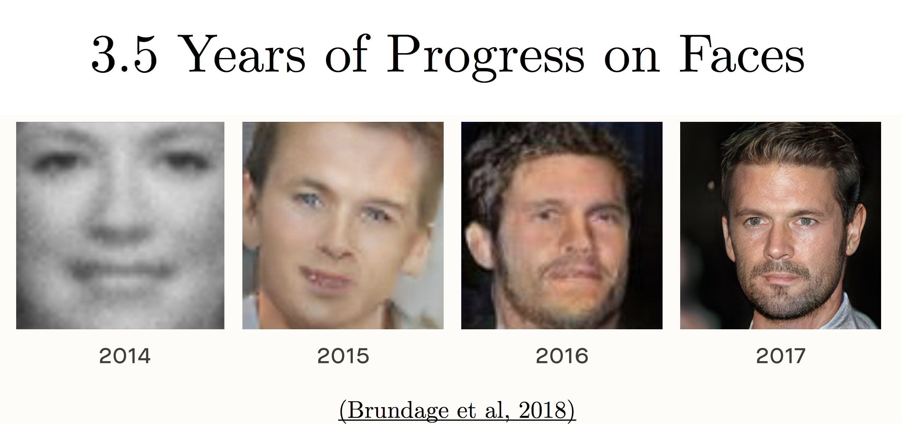
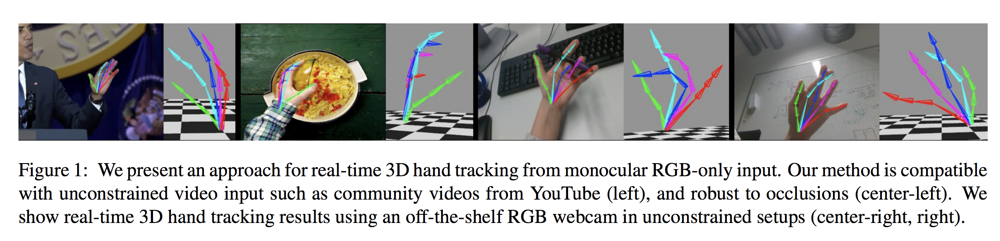
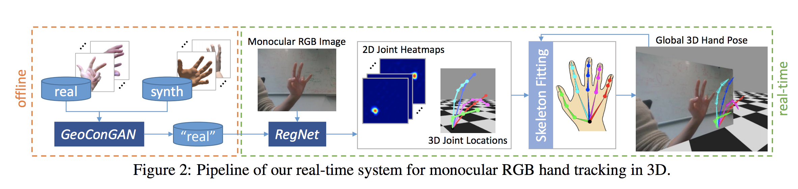
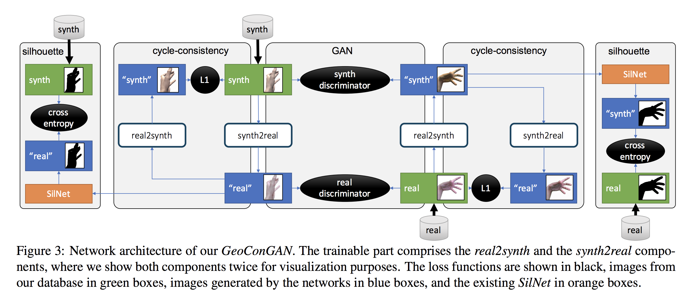
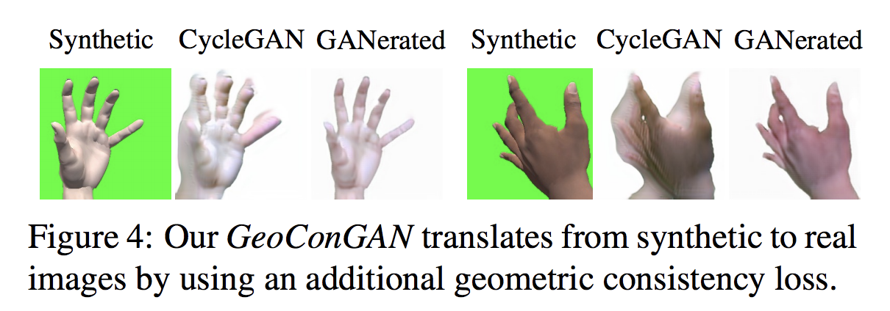
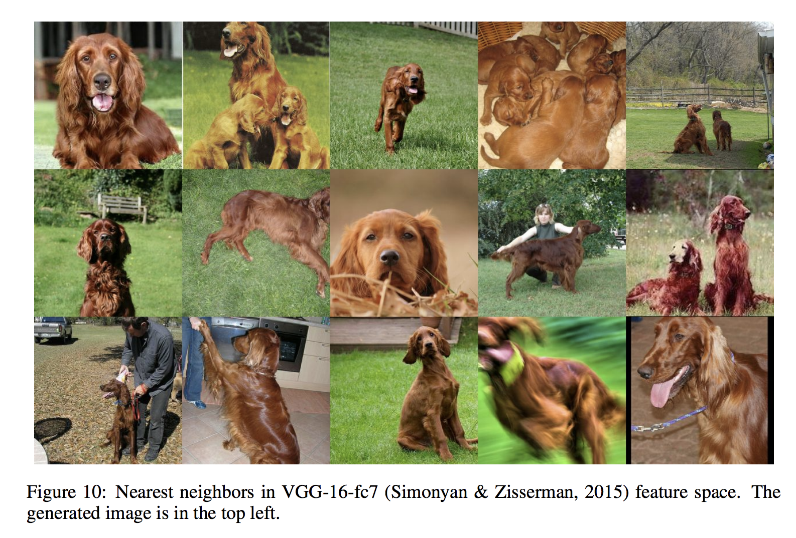
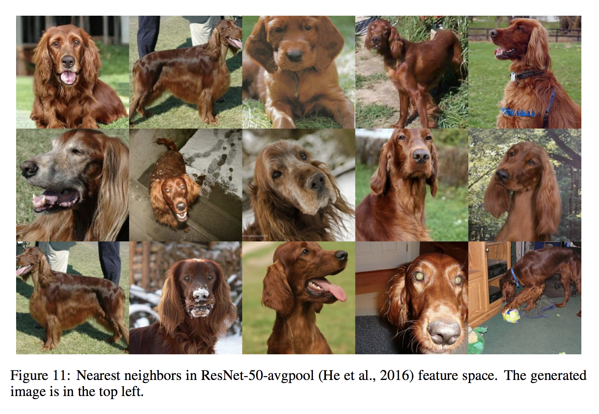

  
## GANs, a very hot topic! {data-background-color="#ffffff"}  

## Points I want to try to address

- What is a GAN?
 

- What are the challenges using GANs? E.g. learning
 

- Examples of applications
 

- Why is it interesting for us!
 

- Check out **iangoodfellow.com** for nice presentations

## What is the problem GANs solve?

- GANs produce very good generative models
 

- They properly model the data manifold
 

- Achieved by using an adversary
    - Learns to discriminate between real and generated samples
    - Pushes generator to become better

## Let's see the difference {data-background-color="#ffffff"}  

## Why the hype? {data-background-color="#ffffff"}  

## Named GANs

- There are around 500 new GAN papers every month, with an upwards trend!
 

- Check out the GAN model zoo on github for inspiration
 

- This is simply too much material to cover
 

- Focus and stick to early and outstanding
 

- If time, look at ganerated hands, as an example application

## The GAN paper

- Basic GAN idea
    - Game between **Generator** $G$ and **Discriminator** $D$
    - Both are generic, in original papers are MLPs
    - This generic part is one of the reason for popularity
 

- $D$ is a differentiable function which discriminates real and generated data, has parameters $\boldsymbol{\theta}^{(D)}$
    - $\mathbf{x}$ is the input
    - $D(\mathbf{x})$ is the probability of sample being real
    - Has cost function $J^{(D)}(\boldsymbol{\theta}^{(D)},\boldsymbol{\theta}^{(G)})$
 

- $G$ is a differentiable function, has parameters $\boldsymbol{\theta}^{(G)}$
    - $\mathbf{z}$ sample from some prior
    - $G(\mathbf{z})$ gives an $\mathbf{x}$ from $p_{\text{model}}$
    - $\mathbf{z}$ is very flexible, can inject noise in many places
    - Has cost function $J^{(G)}(\boldsymbol{\theta}^{(D)},\boldsymbol{\theta}^{(G)})$
 

## How do we train these?

- Some different approaches, use recommendation by IG
 

- Simultaneous SGD
    - Minibatch of $\mathbf{x}$ values from dataset
    - Minibatch of $\mathbf{z}$ value from model prior
 
- Take simultaneous gradient steps
    - update $\boldsymbol{\theta}^{(D)}$ to reduce $J^{(D)}$
    - update $\boldsymbol{\theta}^{(G)}$ to reduce $J^{(G)}$
 
- Can use any gradient base optimization, e.g. Adam

## Cost function for $D$

$$
  J^{(D)}(\boldsymbol{\theta}^{(D)},\boldsymbol{\theta}^{(G)}) = 
  -\frac{1}{2}\mathbb{E}_{\mathbf{x}\sim p_{\text{data}}}\log D(\mathbf{x}) -\frac{1}{2}\mathbb{E}_{\mathbf{z}}\log (1- D(G(\mathbf{z})))
$$

- This is **standard** cross-entropy for binary classifier with a sigmoid output

- Trained with two minibatches of data
    - One from dataset, the ones
    - One generated, the zeroes
    
## Cost function for $G$

- Here are more choices, simplest is the zero-sum game
$$
    J^{(G)} = -J^{(D)}
$$

- This allows us to summarize all into one value function
$$
    V\left( \boldsymbol{\theta}^{(D)},\boldsymbol{\theta}^{(G)} \right) = -J^{(D)}\left( \boldsymbol{\theta}^{(D)},\boldsymbol{\theta}^{(G)} \right)
$$

- This allows us solve a **minimax** proble, which is the solution to zero-sum games
$$
    \boldsymbol{\theta}^{(G)*} = \text{arg} \min_{\boldsymbol{\theta}^{(G)}}\max_{\boldsymbol{\theta}^{(D)}}V\left( \boldsymbol{\theta}^{(D)},\boldsymbol{\theta}^{(G)} \right)
$$

- Mostly interesting for theoretical analysis

## Practical problems and other cost functions

- If the discriminator becomes too good, then gradient for the generator vanishes. It gets stuck and we do not see any improvements.

- Heuristic change, flip target to construct in stead of sign
$$
    J^{(G)} = 
   -\frac{1}{2}\mathbb{E}_{\mathbf{z}}\log D(G(\mathbf{z}))
$$

- Generator now maximizes the probability of the discriminator being wrong, instead of minimizing the probability of the discriminator being correct.

- Can no longer use one single value function

## DCGANs

- Radford et. al 2015
    - Deep convolution GANs
- Three new key insights
    - Batch normalization, in both $G$ and $D$, normalize the two minibatches seperately
    - Based on the **all-convolutional net** (Springenberg et. al 2015), for increasing spatial dimension we use transposed convolution with stride greater than 1.
    - They use Adam instead of SGD with momentum.
    
## Tips and tricks

- Train with labels
    - Make the discriminator recognize specific classes of objects
- One-sided label smoothing
    - Change the ones to $0.9$
- Virtual batch normalization
    - Use a reference batch, sample at beginning, and current batch to estimate normalization values. 
    - Otherwise the two different minibatches cause too much fluctuation in the normalization parameters.
- In practice, $D$ is usually deeper, more filters per layer

## Example use case, CVPR 2018 {data-background-color="#ffffff"}  

## Whole Pipeline {data-background-color="#ffffff"}  

## GeoConGan

- Image to image translation network

- Translate synthetic images to realistic looking images

- We have ground truth annotations for synthetic data, they just don't look real enough

## Generating realistic hands {data-background-color="#ffffff"}  

## Geometric Consistency, important for consistent annotations {data-background-color="#ffffff"}  

## See in action

<iframe width="560" height="315" src="https://www.youtube.com/embed/pHyNrYRhvSg" frameborder="0" allow="autoplay; encrypted-media" allowfullscreen></iframe>

## What do the authors release?

- Implementation in caffe

- Heatmaps are 128 by 128

- Only release forward pass for tracking

## Issues for GANs

- GANs are not the holy grail of deep learning

- They have some very hard problems to solve

## Issues, how to evaluate performance? {data-background-color="#ffffff"}  

Samples from *LARGE SCALE GAN TRAINING FOR HIGH FIDELITY NATURAL IMAGE SYNTHESIS*

## Are these just look ups from the training data? {data-background-color="#ffffff"}  

## Are these just look ups from the training data? {data-background-color="#ffffff"}  

## Are these just look-ups from the training data? {data-background-color="#ffffff"}  

## Future paper to look into

- More examples where GANs are used to synthesize training data

- Cycle gans, maybe info GAN

- Focus on more high resolution image generation
