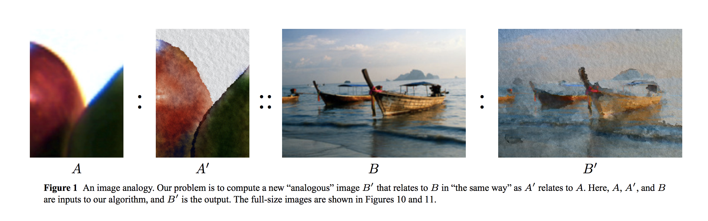
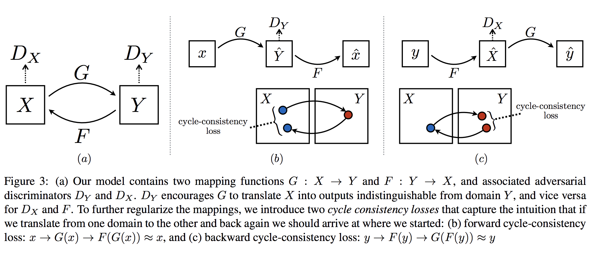
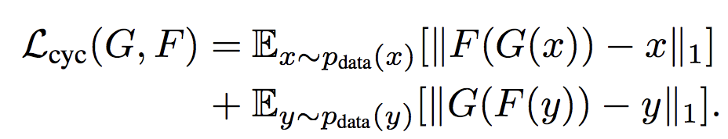
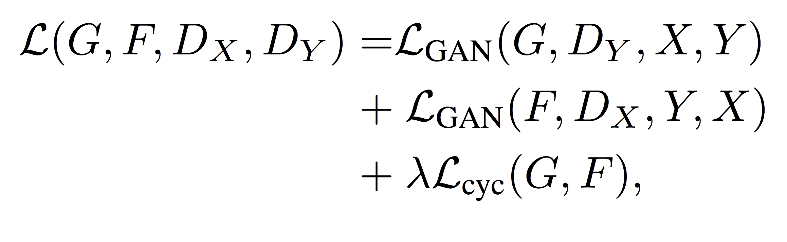
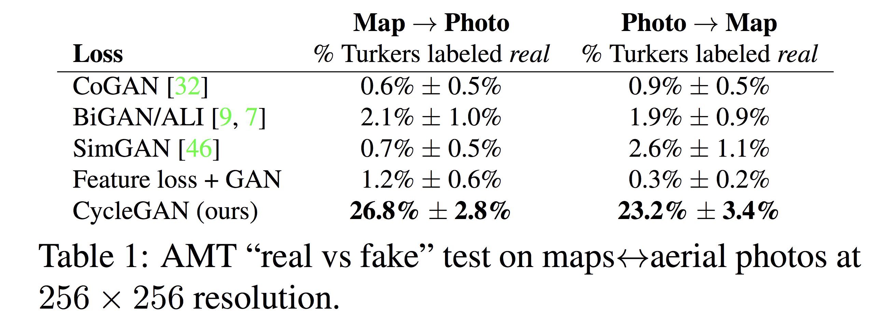
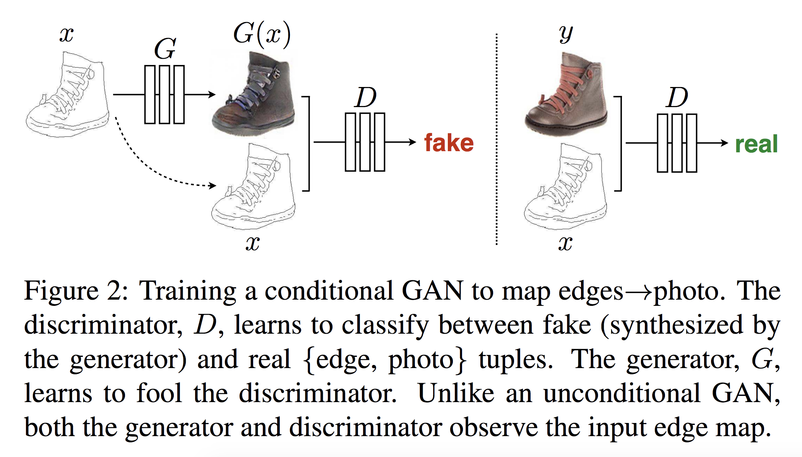

  
## cycle GANs, solves im2im translation! {data-background-color="#ffffff"}  

## They solve it impressively {data-background-color="#ffffff"}  

## Some of this has been done before (2001) {data-background-color="#ffffff"}  

## What is different for image to image translation?

- More **general**, not just style transfer

- Create and estimate correspondance between two high dimensional distributions

- But why is it so big an popular? 

- We do not need matching samples!

- Opens up possibilities for image synthesis

## Non-paired samples {data-background-color="#ffffff"}  

## Why not use GANs?

- We could use a GAN to generate image in other domain and have a discriminator tell if it was generated or not.

- In theory this could work

- In practice it doesn't

- GANs alone do not guarantee that things pair up in meaningful ways, inifinitely many mappings that achieve the same thing.

- Very prone to mode collapse, where everything is mapped to the same thing.

## Cyclic Consistency {data-background-color="#ffffff"}  

## GAN loss {data-background-color="#ffffff"}  

## Cyclic loss, forward and backward {data-background-color="#ffffff"}  

## How consistent is this? {data-background-color="#ffffff"}  

## Full loss {data-background-color="#ffffff"}  

## Paper that inspired Generator Architecture {data-background-color="#ffffff"}  

## Generator details

- Good for neural style transfer and super resolution

- Two stride-2 convolutions

- Several residual blocks

- Two fractionally strided convolutions, with stride $0.5$

- 6 blocks for $128\times 128$, 9 for higher res

- Use instance normalization

## Discriminator details

- Use $70 \times 70$ patchGANs

- Sample overlapping patches from generated and real

- Scales to larger output automatically

- Has fewer parameters than a full image discriminator

## Mechanical Turk Results {data-background-color="#ffffff"}  

## Failure Cases {data-background-color="#ffffff"}  

## Main author has another great paper!

- Image-to-image translation with conditional adversarial networks

- CVPR 2017

- More cited than cycle GAN, a bit different idea

## condGAN {data-background-color="#ffffff"}  

## Other cool recent stuff by these guys

<iframe width="560" height="315" src="https://www.youtube.com/embed/S1OwOd-war8" frameborder="0" allow="autoplay; encrypted-media" allowfullscreen></iframe>

## Awesome new thing

<iframe width="560" height="315" src="https://www.youtube.com/embed/YRb0XAnUpIk" frameborder="0" allow="autoplay; encrypted-media" allowfullscreen></iframe>
